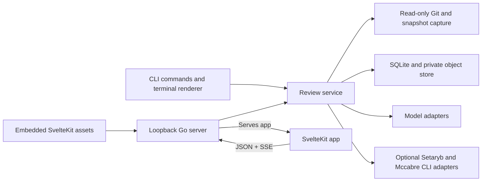

# MIRE

> Model Independent Review Environment

MIRE is a local, model-independent code-review workbench.

## First-time setup

The Go server embeds the SvelteKit production output so you need to build the web
app before compiling the Go binary:

```sh
pnpm --dir app install --frozen-lockfile
pnpm --dir app build
go build ./cmd/mire
```

## Usage

Run MIRE from the Git repository you want to review. Review commands read the
repository, store the immutable snapshot and review ledger in MIRE's private
application state, and never write to the reviewed repository.

Capture a committed comparison:

```sh
mire review --range main..HEAD
mire review --range origin/main...HEAD
```

`mire review` prints progress and its final summary to stderr. The deterministic
static report, unified diff, and verified findings are written to stdout. Use
`--width` for stable narrow output and `--candidates` when auditing retained or
refuted candidates. The built-in baseline is credential-free; no findings is
not an approval, so inspect the coverage and incomplete-analysis sections.

The two-dot form compares the requested base and target directly.

The three-dot form compares the target with the resolved merge base.

Capture the current working tree, including staged, unstaged, and nonignored untracked
files:

```sh
mire review --worktree
```

Each capture creates a session and round.

Append another capture to an existing session with its session ID:

```sh
mire review --session <SESSION> --range main..HEAD
mire review --session <SESSION> --worktree
```

List or delete persisted sessions:

```sh
mire sessions list
mire sessions delete <SESSION>
```

Inspect the current repository's review history and live divergence:

```sh
mire show
mire show <SESSION>
mire show <SESSION> --candidates --width 80
```

Start the authenticated local web workbench:

```sh
mire web
mire web <SESSION>
```

MIRE binds to loopback on an available port, prints a one-time launch URL, and
serves the embedded app in the foreground. Open that URL in a browser and stop
the server with `Ctrl-C`. To request a specific loopback port, pass
`--addr 127.0.0.1:<PORT>`.

Use `MIRE_STATE_DIR` to point isolated development or test runs at a private
state directory:

```sh
MIRE_STATE_DIR=/tmp/mire-state mire sessions list
```

For command details, run `mire <command> --help`.



## References

1. <https://google.github.io/eng-practices/review/reviewer/looking-for.html>
2. <https://developers.googleblog.com/conductor-update-introducing-automated-reviews/>
3. <https://www.greptile.com/what-is-ai-code-review>

## License

[APACHE 2.0](LICENSE)
