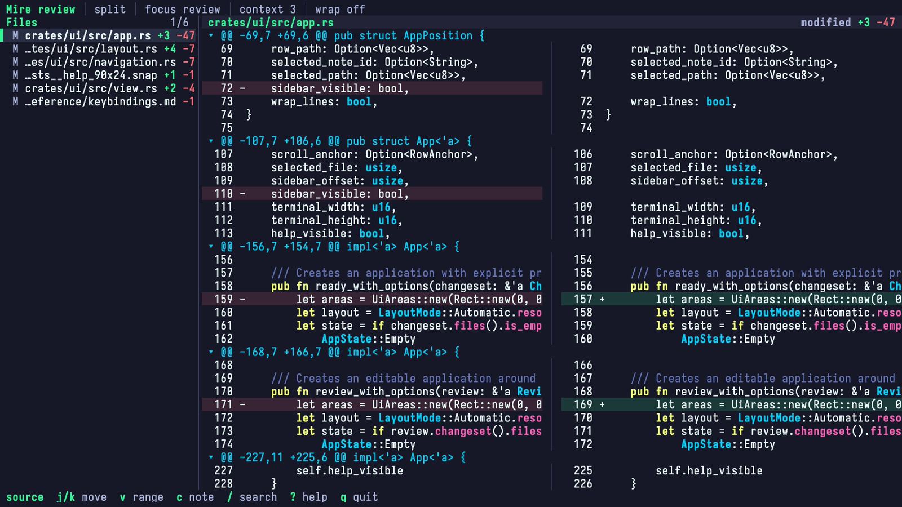

# Mire

> Model Independent Review Environment

Mire is a terminal-based diffing and collaborative code review tool for humans and agents.



## Features

- Review worktree changes, staged changes, revisions, commits, and patch files.
- Move through every changed file in one continuous stream.
- Use unified, split, or responsive layouts with syntax and intraline highlighting.
- Create durable review files with anchored findings, attribution, and decisions.
- Exchange bounded context and findings with local agents through JSON.
- Watch Git comparisons, patches, and source-backed reviews for changes.

## Installation

Mire requires Git and Rust 1.88 or newer.

```sh
git clone https://github.com/stormlightlabs/mire.git
cd mire
cargo install --path crates/cli --locked
```

See the [installation guide](docs/src/content/docs/getting-started/installation.md)
for verification, updates, and uninstall instructions.

## Quick start

Run Mire inside a Git worktree:

```sh
# Unstaged and untracked changes
mire diff

# Staged changes
mire diff --staged

# Changes since this branch diverged from main
mire diff main...HEAD

# One commit
mire show HEAD

# A patch file
mire patch changes.diff
```

Place repository-relative path filters after `--`:

```sh
mire diff main...HEAD -- src tests
```

Press `?` in the TUI for the current keybindings. See
[quick start](docs/src/content/docs/getting-started/quick-start.md) for more information.

## Reviews

Capture a Git comparison in a review file, then open it:

```sh
mire review init review.json main...HEAD -- src tests
mire review review.json --watch

# Refresh without opening the TUI
mire review refresh review.json
```

A source-backed review refreshes from its recorded Git comparison. Mire keeps
exact findings in place, moves only a unique content-supported match, and marks
other findings stale or ambiguous. Mire assigns note identifiers and anchor
fingerprints. Mutations include the review revision the caller read, so stale
writes do not replace newer changes.

See [Review Notes](docs/src/content/docs/guides/review-files.md) for the
complete initialization, agent handoff, refresh, disposition, and export
workflow.

## Agent Skill

Give the review path and Mire's bundled skill to a local agent:

```sh
mire skill <path>
```

The skill tells the agent to inspect the compact manifest, expand only named
context within a byte limit, and apply location-based findings.

## Documentation

- [Installation](docs/src/content/docs/getting-started/installation.md)
- [Quick start](docs/src/content/docs/getting-started/quick-start.md)
- [Reviewing changes](docs/src/content/docs/guides/review-changes.md)
- [Review notes](docs/src/content/docs/guides/review-files.md)
- [Watch mode](docs/src/content/docs/guides/watch-mode.md)
- [CLI manual](docs/src/content/docs/reference/cli.md)
- [Keybindings](docs/src/content/docs/reference/keybindings.md)
- [Review model](docs/src/content/docs/concepts/review-model.md)
- [Live-session protocol](docs/src/content/docs/reference/live-session-protocol.md)

## License

Mire is available under the terms of the [Apache License 2.0](LICENSE).
