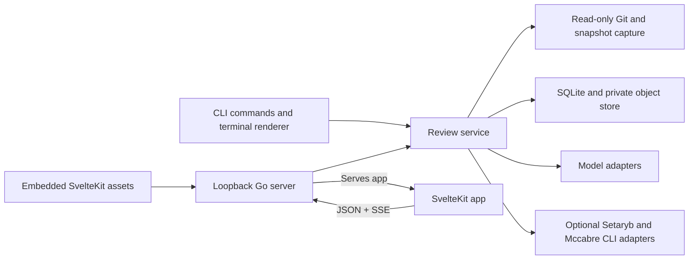

# MIRE

Model Independent Review Environment

## References

1. <https://google.github.io/eng-practices/review/reviewer/looking-for.html>
2. <https://developers.googleblog.com/conductor-update-introducing-automated-reviews/>
3. <https://www.greptile.com/what-is-ai-code-review>
