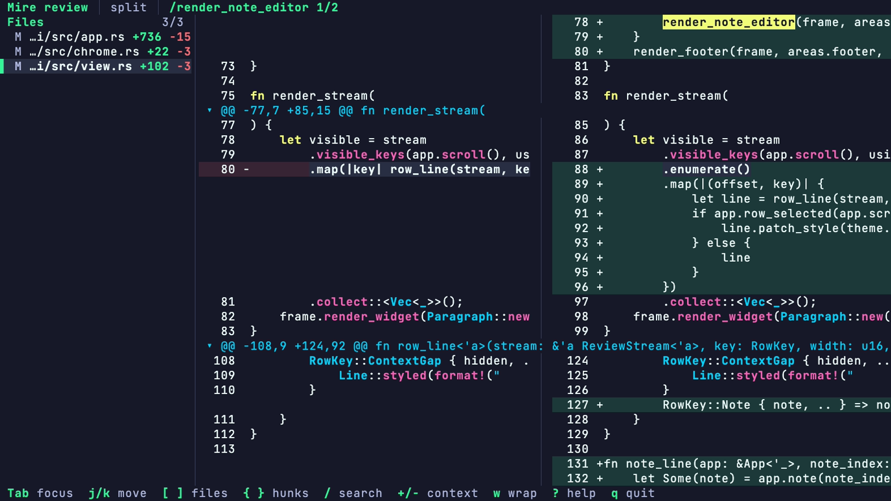

# Mire

> Model Independent Review Environment

Mire is a difftool for humans and agents.



## Features

- Review unstaged and untracked worktree changes, staged changes, revisions,
  commits, or patch files.
- Move through every changed file in one continuous stream or jump by file and
  hunk.
- Switch between unified, split, and automatic layouts while you review.
- Search the full changeset, adjust surrounding context, and wrap long lines.
- Highlight supported languages automatically, with a plain-text fallback for
  everything else.
- Create and disposition durable, anchored review notes from the terminal.
- Produce stable JSON for scripts and other tools.

## Install from source

Mire requires Git and Rust 1.88 or newer.

```sh
git clone https://github.com/stormlightlabs/mire.git
cd mire
cargo install --path crates/cli
```

The last command installs the `mire` executable in Cargo's binary directory,
usually `~/.cargo/bin`.

## Quick start

Run Mire inside a Git worktree:

```sh
# Unstaged and untracked changes
mire diff

# Staged changes
mire diff --staged

# Changes on the current branch since it diverged from main
mire diff main...HEAD

# The latest commit
mire show

# A patch saved on disk
mire patch changes.diff
```

Limit a Git review to one or more repository-relative paths by placing them
after `--`:

```sh
mire diff main...HEAD -- src tests
mire show HEAD~1 -- crates/core
```

Use `mire help`, `mire help diff`, `mire help show`, or `mire help patch` for
the complete command-line reference.

## Keybinds

Press `?` in Mire to show the built-in keybind reference.

### General navigation

| Key           | Action                                                            |
| ------------- | ----------------------------------------------------------------- |
| `q` or `Esc`  | Quit                                                              |
| `?`           | Show or hide keybind help                                         |
| `Tab`         | Switch focus between the file sidebar and review                  |
| `j` or `Down` | Scroll down, or select the next file when the sidebar has focus   |
| `k` or `Up`   | Scroll up, or select the previous file when the sidebar has focus |
| `PgDn`        | Move down one page                                                |
| `PgUp`        | Move up one page                                                  |
| `g` or `Home` | Jump to the first row                                             |
| `G` or `End`  | Jump to the last row                                              |
| `]`           | Jump to the next file                                             |
| `[`           | Jump to the previous file                                         |
| `}`           | Jump to the next hunk                                             |
| `{`           | Jump to the previous hunk                                         |

### Search and display

| Key | Action                                                  |
| --- | ------------------------------------------------------- |
| `/` | Enter a search query                                    |
| `n` | Jump to the next search match                           |
| `N` | Jump to the previous search match                       |
| `+` | Show more context lines                                 |
| `-` | Show fewer context lines                                |
| `w` | Toggle line wrapping                                    |
| `1` | Use the unified layout                                  |
| `2` | Use the split layout                                    |
| `3` | Choose the layout automatically for the available width |

### While entering a search query

| Key                     | Action                             |
| ----------------------- | ---------------------------------- |
| `Enter`                 | Search and jump to the first match |
| `Esc`                   | Cancel search input                |
| `Backspace`             | Delete the previous character      |
| Any printable character | Add it to the query                |

### Durable review notes

Open an existing Mire review file with:

```sh
mire review review.json
```

Review-file sessions add these controls:

| Key                   | Action                                                     |
| --------------------- | ---------------------------------------------------------- |
| `v`                   | Start or clear a source range; move with `j` and `k`       |
| `c`                   | Create a note on the selected range or current source line |
| `e`                   | Edit the selected note                                     |
| `p` / `P`             | Jump to the next or previous visible note                  |
| `r` / `d` / `o`       | Resolve, dismiss, or reopen the selected note              |
| `a`                   | Accept the selected note's risk                            |
| `f`                   | Filter notes by author, status, severity, kind, or file    |
| `Ctrl-S`              | Retry a failed save                                        |
| `Enter` in the editor | Save the note                                              |
| `Tab` / `Shift-Tab`   | Change severity or annotation kind in the editor           |

Mire saves note changes by atomically replacing the review file. If a save
fails, the editor stays open with the note text intact. Right-click a source row
to create a note, or use the action buttons on a note row to edit it and change
its status.

Mire also supports the mouse. Scroll the wheel over the review or sidebar, or
left-click a file or review row to select it.

## Patch input and JSON output

Pass a patch file to open it in the interactive viewer:

```sh
mire patch changes.diff
```

Use `--format json` when another program needs the normalized changeset:

```sh
mire diff --format json > changeset.json
mire patch changes.diff --format json
```

Mire also reads a patch from standard input. Since the interactive viewer needs
stdin for keyboard input, this form writes JSON:

```sh
git diff --no-color | mire patch - > changeset.json
```

Redirecting Mire's output also selects JSON automatically.

## Syntax highlighting and color

Mire detects syntax from file names, extensions, and supported shebangs. If the
detection is wrong, pass `--language` to apply one language to every text file
in the interactive viewer:

```sh
mire diff --language typescript
mire patch changes.diff --language plain
```

Supported values are `bash`, `sh`, `css`, `html`, `javascript`, `js`, `json`,
`markdown`, `md`, `plain`, `plaintext`, `python`, `py`, `rust`, `rs`, `toml`,
`tsx`, `typescript`, `ts`, `yaml`, and `yml`.

Set [`NO_COLOR`](https://github.com/jcs/no_color) to disable color output:

```sh
NO_COLOR=1 mire diff
```

## License

Mire is available under the terms of the [Apache License 2.0](LICENSE).
