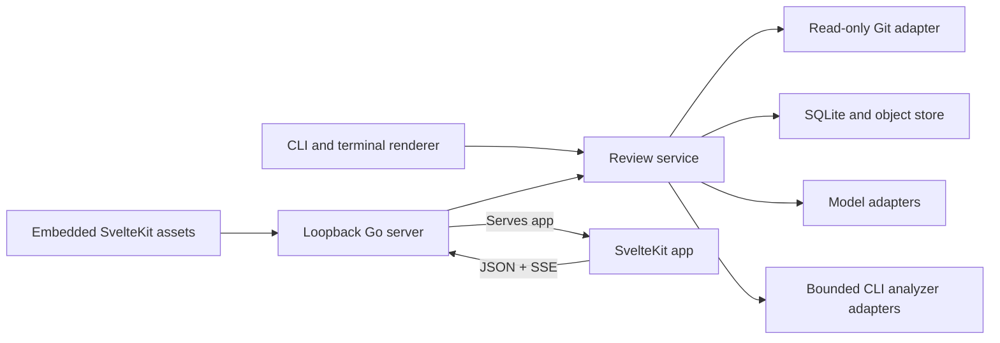

# MIRE V1 plan

MIRE is a local, model-independent code-review workbench. It turns a Git change
into a durable review session containing the exact revision reviewed, the review
plan, candidate and verified findings, supporting and contradicting evidence,
human decisions, and context-bound discussion.

The product is an evidence ledger, not a bot that emits comments. A machine may
identify and investigate risk, but it does not approve a change and it must not
hide uncertainty, missing coverage, or failed analysis.

This document is the canonical V1 product and engineering contract. Implementation
sequencing lives in [the V1 task list](task.md); deferred product contracts live in
the linked V2 and V3 plans.

## Contents

1. [Objective](#objective)
2. [Users and use cases](#users-and-use-cases)
3. [Success criteria](#success-criteria)
4. [Current state](#current-state)
5. [V1 product contract](#v1-product-contract)
6. [V1 architecture](#v1-architecture)
7. [Core domain contracts](#core-domain-contracts)
8. [Interfaces](#interfaces)
9. [Security and privacy](#security-and-privacy)
10. [Testing and verification](#testing-and-verification)
11. [Implementation boundaries](#implementation-boundaries)
12. [Deferred milestones](#deferred-milestones)
13. [Risks and accepted tradeoffs](#risks-and-accepted-tradeoffs)

## Objective

Build a local review environment that gives an engineer two complementary views
of the same review session:

- A command-oriented CLI that captures and runs reviews and renders static,
  readable diffs with anchored comments.
- An interactive SvelteKit application on localhost for investigation, triage,
  evidence inspection, contextual discussion, and export.

The smallest useful release must review committed Git ranges and a complete
working-tree state, preserve every plausible candidate emitted by its configured
review passes, distinguish high-precision verified findings from unverified
candidates, and remain useful when optional companion analyzers are unavailable.

## Users and use cases

The primary V1 user is an engineer reviewing a local repository before or during
a pull request. The repository may contain unpublished commits or uncommitted
work.

The user must be able to:

1. Review a committed two-dot or three-dot range without pushing it to a forge.
2. Review the combined staged, unstaged, and nonignored untracked working tree.
3. See exactly which immutable snapshot, policy, models, tools, and context
   produced a result.
4. Read a concise terminal report containing a pretty diff and anchored comments.
5. Explore logical change slices, findings, evidence, omissions, and review
   coverage in a browser.
6. See verified findings and all retained candidates in visibly separate lanes.
7. Accept, dismiss, defer, resolve, or mark a finding intentional without changing
   its machine-verification record.
8. Ask a question only when it is anchored to a finding or an explicit diff
   selection, and retain that discussion with the review.
9. Re-run verification for a finding without allowing an agent to modify the
   repository or execute arbitrary project commands.
10. Export a portable, versioned review bundle explicitly while keeping normal
    application state private and outside the repository.

## Success criteria

V1 is complete when all of the following are observable:

- One native `mire` binary contains the CLI, local HTTP server, and compiled web
  assets. No Node process, daemon, or container is required at runtime.
- The CLI and HTTP server call the same application service. The CLI does not
  call the HTTP API, and the browser does not bypass it.
- `mire review` can create race-checked, application-owned snapshots for committed
  ranges and working trees without writing to the target repository or its Git
  metadata or depending on its objects remaining available later.
- All review reads, model context, and analyzer inputs come from the captured
  snapshot rather than the live worktree.
- A review records completed passes, examined artifacts, retrieved context,
  failures, truncation, exclusions, and declared coverage gaps. “No findings” is
  never used to represent failed or incomplete analysis.
- Every well-formed candidate emitted by a configured review pass within the
  declared budget is retained before correlation and triage. The product does
  not claim this represents every conceivable defect.
- The primary finding lane contains only findings supported by the verifier and
  the configured evidence threshold. Model confidence alone cannot promote a
  candidate.
- A user can inspect the candidate lane, including inconclusive candidates, and
  can reveal refuted candidates for audit.
- Finding identity survives ordinary line movement when evidence supports a
  match. Ambiguous matches become linked findings rather than falsely reusing an
  identifier.
- Every chat turn has at least one immutable finding or diff reference. The API
  rejects unscoped chat even if the browser has a visible selection.
- OpenAI-compatible and Anthropic model adapters support the planner, reviewer,
  verifier, and contextual-chat roles. All roles may use one model; cross-provider
  routing is optional configuration.
- Optional Setaryb and Mccabre CLI adapters are bounded, provenance-recorded, and
  failure-tolerant. Their absence does not prevent a text-based review.
- The foreground web server binds only to loopback, requires a random launch
  capability for its API, and shuts down cleanly on interruption.
- Markdown, canonical JSON, a multi-file review bundle, and SARIF 2.1.0 findings
  exports are generated deterministically from the same stored session, with the
  fidelity and omissions of each format declared.
- Unit, integration, CLI black-box, HTTP contract, frontend component, and one
  browser end-to-end test suite pass without live model credentials.

Quality must be evaluated separately along these dimensions: factuality, recall,
redundancy, actionability, structured-output reliability, human triage burden,
latency, and cost. Finding count is not a quality metric and no pass has a finding
quota.

## Current state

- The repository is a Go module targeting Go 1.26.2.
- `cmd/mire` and `internal/server` are placeholders.
- `app` is a generated SvelteKit scaffold; it does not implement the review
  application yet.
- The README fixes the high-level dependency direction: CLI and browser share an
  application core; the browser reaches it through local HTTP; web assets are
  embedded.
- `docs/notes` contains the research basis for review quality, review ordering,
  evidence, GitHub review semantics, SARIF export, and future patch validation.
- There is no persistence, Git capture, model integration, analyzer integration,
  terminal renderer, or HTTP contract yet.

The initial implementation should preserve this small surface. Add packages only
when a V1 behavior needs them; do not scaffold a framework for hypothetical
extensions.

## V1 product contract

### Process model

- `mire web` is a foreground, current-repository-scoped process.
- It serves an embedded static SvelteKit application and `/api/v1` from one Go
  process.
- Browser updates use ordinary JSON commands and queries plus Server-Sent Events
  for progress and streamed results.
- There is no JSON-RPC boundary between the CLI and web application.
- There is no background daemon, remote bind mode, multi-repository workspace,
  production Node server, or containerized main application in V1.

### CLI behavior

The initial command vocabulary is:

```text
mire review --range <base>..<head>
mire review --range <base>...<head>
mire review --worktree
mire review --session <SESSION> --range <base>..<head>
mire review --session <SESSION> --range <base>...<head>
mire review --session <SESSION> --worktree
mire show [SESSION]
mire show [SESSION] --candidates
mire web [SESSION]
mire export [SESSION] --format markdown|json|sarif|bundle --output <PATH>
mire sessions list
mire sessions delete <SESSION>
```

`mire review` captures a snapshot and runs the configured review pipeline. By
default it creates a session; `--session` appends a new round to an existing
session after verifying that it belongs to the same repository. It
prints stable progress and a final summary to stderr while reserving stdout for
the requested human or machine result. Findings do not change the process exit
status unless a future explicit policy flag requests that behavior.

`mire show` renders a static, width-aware unified diff with anchored comments.
Verified findings are the primary section. Candidates and incomplete-analysis
diagnostics are distinct sections, never blended into verified output. Respect
`NO_COLOR` and keep golden rendering deterministic.

The terminal does not implement a TUI. Interaction belongs in the browser.

### Review inputs and intent

V1 accepts only local Git input:

- A committed two-dot comparison.
- A committed three-dot comparison using the resolved merge base.
- A complete working-tree target relative to `HEAD`, preserving the distinct
  `HEAD`, index, and final worktree layers and including nonignored untracked
  files.

Resolve symbolic refs to object IDs once and record the requested expression,
effective base, head, merge base when applicable, Git object format, and capture
time. Invalid or ambiguous revisions fail before model calls.

Review intent may be assembled from a user prompt, commit messages, repository
instructions such as `AGENTS.md` and `CONTRIBUTING.md`, relevant architecture
documentation, and an earlier round in the same session. V1 does not fetch pull
requests, linked issues, or remote content.

Policy precedence is deterministic and recorded. Highest precedence comes first:

1. MIRE's built-in safety, evidence, and permission rules. These cannot be
   weakened by configuration or repository content.
2. The user's explicit private review configuration and current review request.
   These may narrow scope or strengthen requirements, but cannot weaken tier 1.
3. Repository review-policy files from the effective base snapshot. For a path,
   a more path-specific policy overrides a general policy only within this tier.
4. Base-snapshot contribution and architecture documentation, which supplies
   context and intent but is not allowed to grant tools or permissions.
5. Target-snapshot policy and documentation changes, which are review evidence
   for this round rather than policy that can judge themselves.

If a repository has no base revision, target policy becomes the initial policy
and that exception is recorded. Conflicts within one tier are surfaced as an
ambiguity and use the safer/more restrictive interpretation; a model must not
silently choose between them. Earlier dispositions and chat do not become durable
policy in V1. Repository text is untrusted model input, not agent authority.

### Frozen snapshot

A snapshot is immutable after capture. Its manifest records every tracked path
and every nonignored untracked path, kind, mode, size, content digest, Git object
ID when present, and the context-policy hash. Every referenced byte is copied into
MIRE's private content-addressed store before the manifest commits; a Git object
may be a capture source and provenance identifier, but is never the sole durable
copy. Regular files, symlink targets, executable bits, binary files, deletions,
renames, and submodule Git links must be represented explicitly. Symlinks are not
followed. Clean submodules are captured as opaque Git links; dirty submodule state
causes working-tree capture to fail and directs the user to review that repository
separately.

Working-tree capture must:

1. Read `HEAD`, the index identity, tracked inventory, and nonignored untracked
   inventory.
2. Capture all snapshot file content into the private content-addressed store,
   deduplicated by digest.
3. Re-read identities and captured-file metadata/content to detect concurrent
   changes.
4. Retry a bounded number of times or fail with a torn-snapshot diagnostic.
5. Persist the manifest only after all referenced content is durable.

Snapshot capture is atomic and complete; there is no incomplete-snapshot mode.
Resource ceilings fail capture before any review round or model call and explain
which limit must be raised. Context policies may keep captured paths away from
models or analyzers, but those exclusions are downstream coverage omissions and
do not remove paths from the private snapshot. Silent truncation is forbidden.

All subsequent file reads use a snapshot filesystem. Optional analyzers receive
a private materialization of that filesystem. They never run against the live
repository. Divergence checks compare current repository state to the manifest
without changing the snapshot.

### Review pipeline

Each review round runs an explicit pipeline:

1. **Change model:** Parse the diff, inventory file and hunk changes, attach
   available lexical symbols, and record contracts, tests, configuration,
   dependencies, migrations, or public surfaces that may be affected.
2. **Review plan:** Produce risk areas, logical change slices, planned review
   passes, required context, and known coverage limitations.
3. **Specialized passes:** Generate candidates for correctness, edge cases,
   security, concurrency/state transitions, performance/resources, API/schema
   compatibility, error handling/observability, tests, deployment/migration,
   maintainability, documentation, and change completeness when applicable.
4. **Finding-specific retrieval:** Begin from the diff and retrieve only the
   smallest context needed to investigate a suspected behavior. Every retrieved
   artifact retains its relationship to changed code and the requesting run.
5. **Adversarial verification:** State the suspected invariant violation, trace a
   concrete path, search for guards and tests, inspect deterministic evidence,
   and try to refute the candidate. V1 verification is read-only and performs no
   project command execution.
6. **Correlation and presentation:** Correlate duplicate or successor findings,
   compute review coverage, and publish the verified and candidate lanes without
   discarding audit history.

The planner, reviewer, and verifier are roles, not independently deployed
services. Their tools are limited to snapshot diff/file reads, bounded snapshot
search, pinned Git metadata/history, recorded repository guidance, and normalized
analyzer evidence. Git queries use only object IDs recorded by the snapshot; the
exact query and output become immutable run input before a model sees them. Live
symbolic refs and the live working tree are never model context.

### Logical slices and navigation

The web app presents an overview and logical slices rather than imposing one
alphabetical file order. Each slice is explainable through its included hunks and
risk cues. Users can navigate or sort by risk, relevance to stated intent, diff
size, tests, and dependency impact. A user-controlled file view remains available.

No ordering is presented as universally optimal. The session records the plan's
default order but does not treat navigation order as evidence that code was
examined.

### Finding ledger

A finding separates these concepts:

- Stable identity and immutable revisions.
- Claim, impact, category, and severity.
- Machine confidence and machine-verification state.
- Candidate, verified, or refuted lane.
- One or more revision-bound anchors.
- Supporting, contradicting, and contextual evidence.
- Originating pass, model run, analyzer run, or chat message.
- Human disposition.
- Versioned publishable comment wording.
- Relationships to duplicates, predecessors, and possible successors.

Machine-verification states are `not_run`, `supported`, `inconclusive`,
`refuted`, and `blocked`. Human dispositions are `open`, `accepted`,
`intentional`, `dismissed`, `deferred`, `resolved`, and `accepted_risk`.
These axes are independent.

Every plausible, schema-valid output from a declared pass is first retained as a
candidate. Unsupported prose, malformed output, and a failed pass become run
diagnostics rather than fabricated findings. Inconclusive candidates remain in
the candidate lane. Refuted candidates remain auditable but are hidden by
default.

The verified view has a non-disableable evidence floor. A finding must have a
schema-valid claim and impact, at least one snapshot-bound source or diff anchor,
at least one concrete supporting evidence record independent of the originating
review assertion, and a completed verifier run that records an attempted
refutation and addresses material contradictory evidence. Configuration may
strengthen this floor but cannot weaken it. A confidence score is descriptive and
never sufficient by itself. Only the human changes disposition. No model or
endpoint can approve the change.

`verified`, `candidate`, and `refuted` are derived views, not writable finding
state. A supported finding that meets the evidence floor is verified; a refuted
finding is refuted; every other retained finding is a candidate. This prevents
contradictory combinations such as a verified but inconclusive finding.

Human dispositions have distinct meanings: `accepted` agrees that an unresolved
finding is valid; `intentional` records deliberate behavior for which no change is
planned; `dismissed` judges the finding invalid or irrelevant; `deferred` accepts
the work but schedules it later; `resolved` links to a later round or evidence
that addresses it; and `accepted_risk` knowingly leaves a valid risk unresolved
with a rationale. Disposition changes are append-only events.

Finding revisions are immutable. Editing a claim, anchor set, verification
record, or comment creates a new revision or presentation record. Carry a stable
ID across rounds only when claim/invariant and anchor fingerprints strongly
match. Otherwise create a new linked finding; false continuity is worse than a
visible possible duplicate.

### Anchors and evidence

Line numbers are display metadata, not identity. An anchor includes:

- Snapshot and layer/side.
- Normalized path and blob digest.
- Start/end line and original diff hunk.
- Hunk and surrounding-context digests.
- Symbol and syntax fingerprint when available.

Evidence records a `supports`, `contradicts`, or `contextualizes` relationship;
its snapshot, anchors, artifact digest, summary, and producing run; and an exact
pointer into retained normalized output. Evidence may come from a diff, source
context, repository instruction, deterministic analyzer, or model investigation.

Review coverage records what was actually examined: changed files/hunks, optional
symbols and callers, retrieved tests/contracts, completed passes, analyzers used,
and explicit omissions. It must not imply semantic coverage when only lexical or
textual evidence was available.

### Context-bound chat

Each review session has one durable chat timeline. There is no unscoped chat.

Every user message must include a nonempty context containing at least one of:

- An exact finding ID and finding revision from the active review round.
- One or more validated diff anchors from the round's immutable snapshot.

The service resolves and stores that binding before starting a model. The
assistant response inherits the same primary binding. A visible browser selection
is insufficient unless the client submits it and the server validates it.

The chat agent may retrieve additional snapshot context, but every added artifact
is logged as run input. Chat may explain or challenge a claim, compare evidence,
request verification, or propose a new structured candidate. It cannot silently
change findings, dispositions, comment wording, or repository files. Proposed
state changes require an explicit structured user action.

Changing the visible selection does not rewrite earlier messages. If the live
repository diverges, affected chat remains valid for its frozen snapshot and is
visibly marked stale relative to the current worktree.

### Model routing

V1 provides:

- An OpenAI-compatible HTTP adapter with configurable base URL and model.
- A native Anthropic HTTP adapter.
- Role configuration for `planner`, `reviewer`, `verifier`, and `chat`.
- Per-run cancellation, token/cost accounting when supplied by the provider,
  bounded retries, and explicit timeout/budget termination.
- Strict structured-output validation and repair/retry limits.

Use provider-neutral domain types. Provider request/response DTOs stay inside
their adapters. A run records adapter and protocol version, provider alias,
requested and resolved model, prompt-template version, parameters, input
manifest, request/response digests, usage, finish reason, status, and all
redaction or context-policy transformations.

Credentials come from environment variables or an operating-system credential
facility. They are never stored in the review database, browser state, logs, or
exports. Configuration may store a credential reference, never its value.

### Companion analyzers

V1 contains fixed, optional first-party adapters for the installed `setaryb` and
`mccabre` CLIs. This is an internal analyzer seam, not a public plugin system.

Adapters must:

- Be explicitly enabled by the user and capability-probed before a run.
- Invoke an explicit argument vector without a shell.
- Run against a private snapshot materialization.
- Use a minimal environment and bounded timeout, stdout, and stderr.
- Support cancellation and capture exit status and diagnostics.
- Validate the expected JSON shape/schema and normalize into MIRE-owned evidence.
- Record adapter version, executable version/digest, arguments template,
  configuration, snapshot, limits, raw-output digest, normalized-output digest,
  status, and limitations.
- Distinguish successful empty output, partial output, unavailable tools,
  incompatible schemas, and failures.

The V1 Setaryb adapter consumes its map operation only. It provides syntax-aware
lexical symbols, references, and ranking. Its output must be labeled `lexical`;
it does not resolve imports, types, macros, runtime behavior, or semantic calls.
Setaryb history reports are deferred until their revision and provenance contract
can be reconciled with MIRE snapshots.

The V1 Mccabre adapter consumes its read-only JSON analysis operation and
normalizes LOC, heuristic complexity, and exact-token clone evidence. Coverage
report generation and ingestion are deferred from this first adapter. Mccabre's
outputs are review signals and candidate evidence, not verification by themselves.

The baseline MIRE binary works without either executable. V1 does not bundle the
tools, use Rust FFI, expose a generic analyzer manifest, or depend on Thunderus's
draft Quiver contract. The internal seam should remain capable of converging on a
versioned shared process contract later.

The V1 prohibition on command execution means no model-directed, user-supplied,
or project command execution. Fixed, explicitly enabled analyzer adapters are the
only subprocess exception. They are trusted installed programs in V1; true OS
sandboxing arrives in V2.

### Private application state and export

Normal state lives in the operating system's private per-user application-state
directory, never in the reviewed repository. Use one global SQLite database plus
a content-addressed object directory. Include `repository_id` in every relevant
record from the first migration so V2 can add multi-repository workflows without
rewriting the domain.

SQLite uses foreign keys, WAL, a busy timeout, restrictive permissions, and
transactional forward migrations. Handwrite SQL; do not add an ORM or event-
sourcing framework. Use current-state tables plus an append-only audit/activity
table. Large immutable content lives beside the database and is referenced by
digest.

The canonical portable contract is a versioned `review.json` document independent
of the SQLite schema. It contains the normalized review ledger, snapshot manifest,
artifact descriptors, provenance, coverage, and omissions, but not credentials or
the complete snapshot object store. It is an inspectable agent handoff, not an
importable or replayable session in V1.

`--format json` writes that canonical document. `--format bundle` writes a
multi-file directory containing the same `review.json` plus human and
interoperability views and the evidence excerpts/artifacts explicitly named by
the manifest:

```text
REVIEW.md
review.json
manifest.json
diff.patch
findings.json
evidence.jsonl
chat.jsonl
activity.jsonl
findings.sarif
```

`manifest.json` identifies the repository, snapshot/comparison, schema, MIRE
version, configuration and policy hashes, models, analyzers, creation time,
coverage, included artifacts, excluded snapshot objects, and omissions. Export
ordering and IDs are deterministic. Export never includes credentials and does
not overwrite an existing destination implicitly.

Markdown is the human front door. Canonical JSON retains the normalized ledger.
The bundle is a convenient inspectable handoff but cannot recreate MIRE's private
snapshot. Markdown and `findings.json` are focused projections. SARIF 2.1.0 is a
findings-only interoperability view and must document the loss of chat, detailed
verification history, and rich dispositions. Restorable export/import, if later
needed, must define snapshot-object inclusion and privacy separately.

## V1 architecture



### Technology choices

- Go 1.26.2, as declared by `go.mod`.
- Standard-library `flag`, `net/http`, `encoding/json`, `context`, `os/exec`, and
  `database/sql` unless a requirement proves them insufficient.
- A pinned CGo-free SQLite driver (`modernc.org/sqlite`) for portable native
  builds.
- SvelteKit with TypeScript and `adapter-static`, built by pnpm as a client-side
  application. No SvelteKit server routes or production Node runtime.
- Vitest for frontend unit/component tests and Playwright for the narrow browser
  end-to-end boundary.
- Provider APIs implemented behind small `net/http` adapters rather than leaking
  an SDK's types into the core.

The committed scaffold currently uses `adapter-auto`; the implementation must
replace it with the pinned static adapter before embedding production assets.

### Suggested project structure

```text
cmd/mire/                 process wiring, signals, and exit status
internal/cli/             command parsing and stdout/stderr ownership
internal/review/          domain types, use cases, and narrow consumer-owned ports
internal/gitrepo/         read-only discovery, diffing, capture, and divergence
internal/sqlite/          persistence and handwritten migrations
internal/model/           OpenAI-compatible and Anthropic transports
internal/analyzer/        bounded runner plus Setaryb and Mccabre adapters
internal/terminal/        deterministic static rendering
internal/server/          JSON API, SSE, local authentication, embedded app serving
app/                      SvelteKit source, tests, generated build, and Go embed package
internal/acceptance/      compiled CLI and loopback-server acceptance tests
testdata/                 small repository and protocol fixtures where package-local fixtures do not suffice
```

`internal/review` owns only the I/O interfaces it consumes: store, snapshot
source, model, analyzer, and event sink. Do not create interfaces for ordinary
helpers. Inject time and ID generation for deterministic tests.

Avoid `pkg`, generic `utils`, dependency-injection containers, ORMs, an event bus,
a generic plugin framework, or separate services. HTTP DTOs, SQLite rows, model
payloads, analyzer payloads, and domain values are separate types at their
boundaries.

## Core domain contracts

The examples below establish required information and invariants, not final Go
field names.

### Repository, snapshot, session, and round

```text
Repository {
  id, canonical_identity, display_name, discovered_git_dir, created_at
}

Snapshot {
  id, repository_id, kind, requested_comparison,
  effective_base_oid, target_oid, merge_base_oid,
  layers[], manifest_digest, context_policy_hash,
  complete, omissions[], created_at
}

ReviewSession {
  id, repository_id, title, created_at, current_round_id
}

ReviewRound {
  id, session_id, number, snapshot_id, previous_round_id,
  intent, configuration_hash, status, coverage, omissions
}
```

Round status is `pending`, `running`, `complete`, `incomplete`, or `cancelled`.
A new repository state creates a new snapshot and round; it never mutates the
prior round.

### Finding, anchor, and evidence

```text
FindingRevision {
  finding_id, revision, round_id, snapshot_id,
  claim, impact, category, severity, confidence,
  verification, anchor_ids[], evidence_ids[],
  origin, relationships[], created_at
}

Anchor {
  id, snapshot_id, side, path, blob_digest,
  start_line, end_line, original_hunk,
  hunk_digest, context_digest, symbol?, syntax_fingerprint?
}

Evidence {
  id, snapshot_id, kind, relation, summary,
  anchor_ids[], artifact_digest?, producer_run_id, output_pointer?
}
```

Severity and confidence are independent. Verification and human disposition are
independent. The presentation lane is derived from verification and the evidence
floor. Comment wording is a separate versioned presentation record.

### Chat

```text
ChatMessage {
  id, session_id, round_id, role, body, created_at,
  context: {
    refs: FindingRevisionRef | DiffAnchorRef [1..n]
  },
  producer_run_id?, reply_to?
}
```

The domain and database both enforce a nonempty context. Each reference resolves
to the same round and snapshot as the message. Assistant messages copy the
canonical primary binding of the triggering user turn.

### Runs and operations

Long-running review, verification, chat, analyzer, and export work is represented
as an operation with `queued`, `running`, `complete`, `failed`, `cancelled`, or
`abandoned` status. Permit one state-changing/model operation per session at a
time in V1. Enforce this across CLI and web processes with a transactional SQLite
lease and unique active-operation constraint. A random process-instance ID owns
the lease and renews a bounded heartbeat; startup and acquisition mark an expired
owner's operation `abandoned` and its round `incomplete` before proceeding.
Read-only queries may proceed concurrently.

Every model or analyzer run has immutable input/output provenance and belongs to
an operation and round. Completed durable state is authoritative; streamed text
and progress are best-effort presentation.

## Interfaces

### HTTP and SSE

Representative V1 endpoints are:

```text
GET  /api/v1/bootstrap
GET  /api/v1/sessions
POST /api/v1/sessions
GET  /api/v1/sessions/{sessionId}
POST /api/v1/sessions/{sessionId}/rounds
POST /api/v1/rounds/{roundId}/reviews

GET  /api/v1/rounds/{roundId}/diff
GET  /api/v1/rounds/{roundId}/slices
GET  /api/v1/rounds/{roundId}/findings?lane=verified|candidate|refuted
GET  /api/v1/rounds/{roundId}/coverage
GET  /api/v1/rounds/{roundId}/divergence
GET  /api/v1/findings/{findingId}

POST /api/v1/findings/{findingId}/verifications
POST /api/v1/findings/{findingId}/dispositions
POST /api/v1/findings/{findingId}/comment-revisions

GET  /api/v1/sessions/{sessionId}/chat/messages
POST /api/v1/sessions/{sessionId}/chat/turns

POST /api/v1/sessions/{sessionId}/exports
GET  /api/v1/exports/{exportId}
GET  /api/v1/operations/{operationId}
POST /api/v1/operations/{operationId}/cancel
GET  /api/v1/events?sessionId={sessionId}
```

Long-running POSTs return `202 Accepted` with an operation resource. Creation
requests require an idempotency key. Revision-changing requests require the
expected current entity revision and return a conflict on stale writes.

SSE events carry a monotonically increasing database activity ID, schema version, session,
operation, event kind, and affected entity version. Support `Last-Event-ID` for
durable state transitions. A reconnect may lose transient token deltas but must
recover completed messages and finding state through queries.
The server tails the durable activity table, using a local wake-up plus bounded
polling so operations written by another CLI process also reach connected
browsers.

### Web application

The SvelteKit app provides:

- Session and round overview, intent, status, divergence, and review coverage.
- Logical-slice navigation and user-controlled ordering.
- Unified and side-by-side diff modes with stable anchors.
- Clearly separated verified, candidate, and refuted finding views.
- Evidence, provenance, analyzer limitations, and retrieved-context inspection.
- Explicit human disposition and comment-edit actions.
- One chat timeline whose composer is disabled until a finding or diff context is
  selected, with the bound context visible on every message.
- Verification requests, operation progress/cancellation, and explicit export.
- Keyboard navigation, accessible focus management, non-color status cues, and
  layouts usable at ordinary laptop widths.

The app never accepts arbitrary commands, executable paths, project paths, or
provider credentials through a general-purpose endpoint.

## Security and privacy

- Bind the server to `127.0.0.1` and `::1` only. Remote binding is not a V1 mode.
- Generate a new high-entropy launch capability per server process. A one-time
  launch URL establishes an HttpOnly, SameSite cookie and redirects to a clean
  URL.
- Reject unexpected `Host` and `Origin` values and do not enable CORS.
- Require authenticated, JSON-only state-changing requests and protect SSE with
  the same local session capability.
- Treat repository content and analyzer output as untrusted data. They cannot
  add tools, change policy precedence, or widen permissions through instructions.
- Canonicalize every repository-relative path and reject traversal, absolute
  paths, special devices, and snapshot escapes.
- Never pass analyzer arguments through a shell. Bound time, output, environment,
  and cancellation.
- V1 analyzers remain trusted host executables with the user's OS authority. A
  private materialization prevents accidental repository writes but is not a
  security sandbox; disclose this when enabling them.
- Model tools are read-only. They cannot invoke analyzers dynamically, run tests,
  generate/apply patches, write files, mutate Git, or contact arbitrary URLs.
- MIRE itself performs outbound network access only to explicitly configured
  model endpoints. V1 cannot enforce the network behavior of trusted analyzer
  executables; that requires the V2 sandbox boundary.
- Record redactions and omissions. Never log secrets, authorization headers, raw
  credential values, or sensitive launch tokens.
- Private state uses restrictive permissions. Export is explicit and warns that
  bundles may contain code and model conversation.

## Testing and verification

### Stable test boundaries

- **Review domain:** Table-driven tests for state transitions, evidence promotion,
  stable IDs, finding correlation, human dispositions, required chat context,
  operation leases, cancellation, and repository isolation.
- **Git and snapshots:** Real temporary Git repositories covering two-dot and
  three-dot ranges, staged/unstaged overlap, nonignored untracked files, deletions,
  renames, binary files, symlinks, executable modes, spaces, invalid refs,
  concurrent capture changes, size limits, and post-capture divergence.
- **Persistence:** Real temporary database files covering fresh and upgraded
  migrations, restart durability, foreign keys, transactions, concurrent readers,
  audit atomicity, object-write failure, and multi-repository key isolation.
- **Model adapters:** `httptest.Server` fixtures covering streaming, structured
  output, malformed frames, cancellation, rate limits, retries, timeouts, usage,
  redaction, and budget termination. Default tests never call live providers.
- **Analyzer adapters:** Helper executables covering capability versions, valid
  output, empty output, incompatible schemas, invalid JSON, nonzero exits,
  timeout, cancellation, oversized stdout/stderr, and provenance. Never use a
  shell.
- **HTTP server:** `httptest` contract tests for DTO validation, idempotency,
  optimistic concurrency, SSE ordering/reconnect, cancellation, Host/Origin/
  launch-token security, cache headers, and Svelte fallback routing.
- **Terminal:** Golden tests at fixed widths with and without color, covering both
  lanes, omissions, moved anchors, Unicode, stdout/stderr separation, and stable
  exit semantics.
- **Web:** Component tests for navigation, lane filters, evidence views,
  dispositions, comment editing, and the mandatory-context composer. Maintain one
  narrow Playwright flow against the real Go server for review reload, SSE,
  contextual chat, persistence, and export.
- **Release smoke:** Build assets and the native binary, start it on a random
  loopback port against a temporary repository, verify `/` and `/api/v1`, then
  terminate it cleanly.
- **Review quality:** Maintain a frozen, human-adjudicated evaluation corpus with
  at least 100 representative seeded or historical candidates. For each supported
  release model configuration, the verified view must reach at least 90% factual
  and actionable precision, with no verified item lacking the normative evidence
  floor and no unsupported blocker/high-severity finding. Candidate recall,
  redundancy, abstentions, latency, cost, and parsing failures are reported even
  when they are not release gates. No minimum finding count is imposed.

The highest stable acceptance boundaries are the compiled CLI against fixture Git
repositories and the browser against the real local Go server. Lower-level tests
support these boundaries but do not replace them.

### Commands

```text
pnpm --dir app install --frozen-lockfile
pnpm --dir app exec playwright install chromium
pnpm --dir app check
pnpm --dir app lint
pnpm --dir app test:unit --run
pnpm --dir app build
pnpm --dir app exec playwright test

go fmt ./...
go vet ./...
go test ./...
go test -race ./...
mkdir -p dist
go build -trimpath -o dist/mire ./cmd/mire
go test ./internal/acceptance -run TestReleaseSmoke
```

The web build precedes commands that compile the embed package. `go fmt` is the
formatting command; CI runs it in a clean checkout and fails if it changes tracked
files. The acceptance package owns the compiled-binary smoke test. A thin Makefile
may alias these commands later but must not contain hidden build logic.

### V1 release verification

A human release review must confirm:

- The binary performs no target-repository or Git-metadata writes across the
  committed-range and working-tree fixture matrix.
- A changed file during capture produces a retry or explicit failure, never a
  mixed snapshot.
- A provider/analyzer failure cannot appear as a successful no-findings review.
- An unscoped chat request is rejected by the server even when manually crafted.
- Browser refresh/reconnect recovers canonical chat, finding, and operation state.
- Verified and candidate findings are visually and semantically distinct in CLI,
  web, JSON, and Markdown.
- Exports contain required provenance and no configured credentials.
- Optional analyzers can be absent, incompatible, slow, noisy, or failing without
  corrupting the session.
- The baseline binary works offline after it is built, except when a user starts
  a configured model operation.

## Implementation boundaries

### Always

- Keep Git and target project files read-only in V1.
- Prefer the Go standard library and narrow, consumer-owned interfaces.
- Validate data at every external boundary and preserve failure provenance.
- Add or update tests with each behavior.
- Keep generated web output reproducible and out of hand-edited source.
- Preserve schema and export migrations once released.
- Make partial and incomplete states explicit.

### Ask first

- Add a production dependency or framework not named in this specification.
- Change a released SQLite, HTTP, event, or export schema.
- Widen network, filesystem, process, model-tool, or browser authority.
- Bind beyond loopback or introduce a background process.
- Add a new executable adapter or make an optional analyzer mandatory.
- Write any state into a reviewed repository before the repo-local V2 design is
  explicitly approved.

### Never

- Commit, push, rewrite, stage, or otherwise mutate Git as part of V1 review.
- Run arbitrary shell or project commands.
- Treat model confidence, analyzer output, or absence of findings as approval.
- Hide failed, truncated, skipped, or unsupported analysis.
- Persist or export credentials and launch secrets.
- Let HTTP, provider, analyzer, SQLite, or SARIF representations become the core
  domain model.

## Deferred milestones

V1 remains a foreground, single-repository, read-only review workbench. Later
milestones extend its repository-keyed domain and versioned boundaries rather
than replacing them:

- [V2 plan](../v2/plan.md): multi-repository workspaces, opt-in repo-local and
  version-controlled knowledge, sandboxed execution and patch validation,
  semantic analyzer providers, a stable extension contract, and optional MCP
  exposure.
- [V3 plan](../v3/plan.md): local-first forge import, publication, and
  synchronization while preserving MIRE's local finding identity and explicit
  human submission authority.

Longer-term research includes review-quality regression gates, privacy-controlled
navigation evaluation, SARIF import, optional ACP integration, and storage
retention and compaction. Those efforts must not weaken the V1 evidence,
provenance, privacy, or authority boundaries.

## Risks and accepted tradeoffs

### Model quality and review completeness

Automated review has limited recall and can become worse when given indiscriminate
repository context. V1 therefore uses diff-centered, finding-specific retrieval,
separates candidates from verified findings, permits abstention, records coverage,
and makes no exhaustive-review claim.

### Snapshot cost

Complete working-tree capture and analyzer materialization can consume time and
private storage on large repositories. Content addressing and explicit resource
policy mitigate this. Silent caps and incomplete snapshots are not acceptable;
exceeding a capture limit fails before the review starts. Downstream review passes
may still finish incomplete, with their omissions recorded.

### Anchor continuity

No fingerprint guarantees identity after arbitrary rewrites. V1 deliberately
prefers a linked possible successor or duplicate over incorrect stable-ID reuse.

### Localhost exposure

Loopback is not an authentication boundary by itself. The random launch
capability, cookie, Host/Origin validation, no-CORS policy, narrow API, and
read-only V1 tools reduce browser and local-process risk. Remote service operation
requires a new threat model.

### Prompt injection and data disclosure

Repositories contain untrusted instructions and may contain secrets. Deterministic
policy precedence, path/context policy, bounded read-only tools, recorded
redactions, explicit model invocation, and no arbitrary network tools limit the
impact. Users remain responsible for the provider endpoint they configure.

### Companion-tool maturity

Setaryb, Mccabre, and Thunderus are pre-1.0 and their planned shared extension
contracts are not stable. Built-in translation adapters isolate their JSON from
MIRE's domain, record versions and limitations, and degrade visibly. Direct
linking or a public plugin contract would create premature coupling.

### Unsandboxed analyzers

V1's fixed analyzers are installed programs with normal user authority. Running
them on a private snapshot and bounding the child process does not contain a
malicious executable. They require explicit enablement; OS/container isolation is
deliberately sequenced into V2.

### Provider variation

“OpenAI-compatible” endpoints vary in streaming, structured output, usage, and
error behavior. The adapter advertises detected capabilities, records the actual
protocol behavior, validates every result, and reports partial support instead of
silently assuming parity.

### Platform support

V1 release verification targets macOS and Linux. The architecture avoids CGo and
platform-specific shell behavior so Windows support can be added without a core
rewrite, but it is not claimed until Git, filesystem, permissions, browser launch,
and end-to-end tests run there.

No unresolved product decision currently blocks V1 ticketing. Numeric defaults
for storage ceilings, model budgets, timeouts, and retry counts must be chosen from
fixtures and measured tests during implementation, recorded in configuration, and
reviewed before the V1 release candidate.
